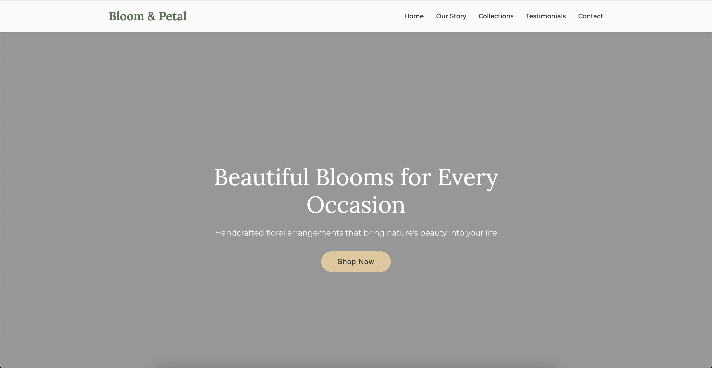
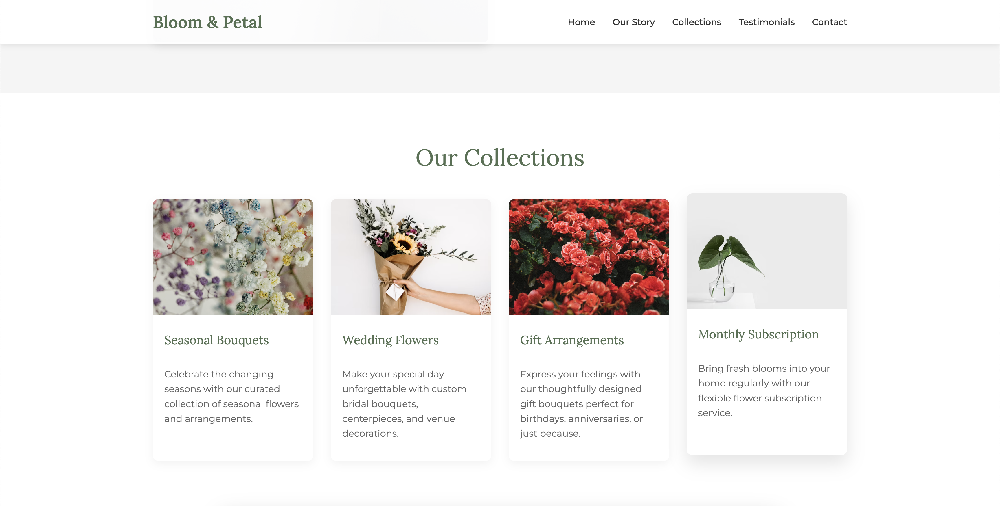
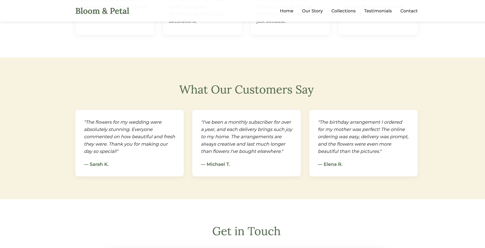
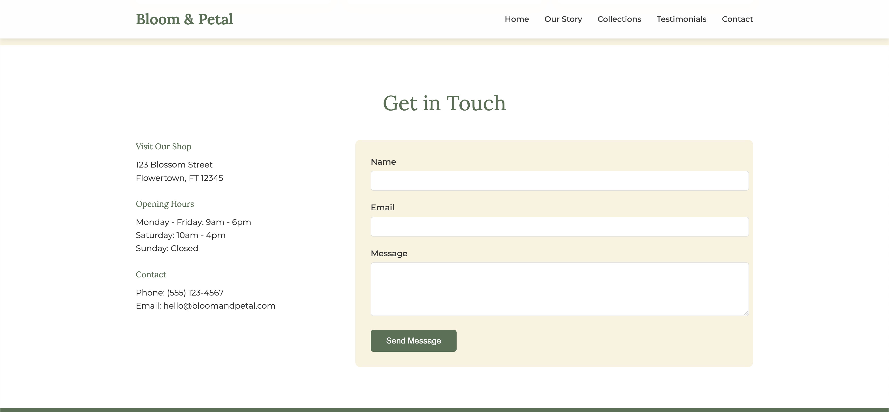

# Bloom & Petal - Flower Shop Landing Page

A beautiful and responsive landing page for a fictitious artisanal flower shop called "Bloom & Petal". This project was created as part of the TUM Web Development Lab 2 assignment.



## Live Demo

[View the live demo](https://eduard-balamatiuc.github.io/tum-web-lab2/) 

## Project Description

Bloom & Petal is an elegant flower shop specializing in handcrafted floral arrangements for all occasions. The landing page showcases the shop's offerings through visually appealing design and intuitive navigation.

The website features:

- Clean, responsive design with a nature-inspired color palette
- Interactive navigation with smooth scroll to sections
- Stunning imagery of floral arrangements
- Detailed information about the shop's collections and services
- Customer testimonials to build trust
- A contact form for inquiries
- Mobile-friendly layout

## Page Sections

1. **Hero Section** - Eye-catching introduction with a call-to-action
2. **Our Story** - Background information about the business
3. **Collections** - Showcase of different product categories
4. **Testimonials** - Customer reviews and feedback
5. **Contact** - Form and information for reaching the shop

## Screenshots

### Hero Section


### Collections


### Testimonials


### Contact Form


## Technologies Used

- **HTML5** - Semantic markup structure
- **CSS3** - Custom styling with:
  - Flexbox
  - CSS Grid
  - Custom animations and transitions
  - Media queries for responsive design
- **Google Fonts** - Lora and Montserrat font families
- **Unsplash** - High-quality royalty-free images

## Development Details

- Vanilla HTML and CSS (no frameworks)
- Mobile-responsive design
- Custom color palette featuring soft greens and warm accents
- Clean, modern typography

## Setup Instructions

1. Clone the repository:
   ```
   git clone https://github.com/eduard-balamatiuc/tum-web-lab2.git
   ```
2. Navigate to the project directory:
   ```
   cd tum-web-lab2
   ```
3. Open `index.html` in your browser to view the project locally

## Future Improvements

- Add JavaScript functionality for form submission
- Implement a mobile-friendly navigation menu
- Create individual product pages
- Add an e-commerce shopping cart
- Implement image galleries for each collection

## Credits

- Images: [Unsplash](https://unsplash.com)
- Fonts: [Google Fonts](https://fonts.google.com)
